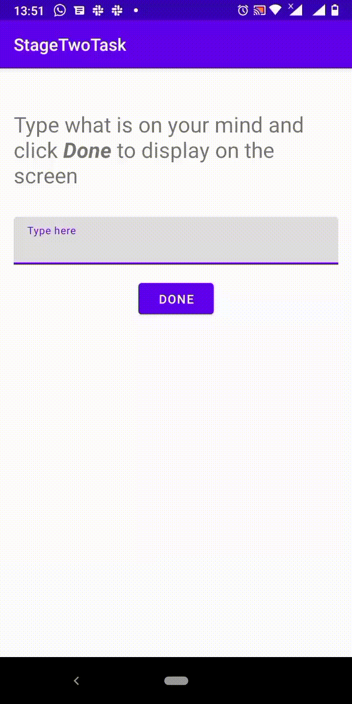

# HNG STAGE TWO TASK

This is stage 2 tasks for [i4g Internship](https://ingressive.org/).  

## TASK COMPLETED
- [x] A program that prints name using java programming language. View the file [PrintName.java](PrintName.java)

- [x] An android app that collects user input and displays the input on the screen. Click [here](https://appetize.io/app/7xfj7rv2ghbw9wkwv12kj0npxm?device=nexus5&scale=75&orientation=portrait&osVersion=9.0) to use the app.

- [x] A demo of the android app

